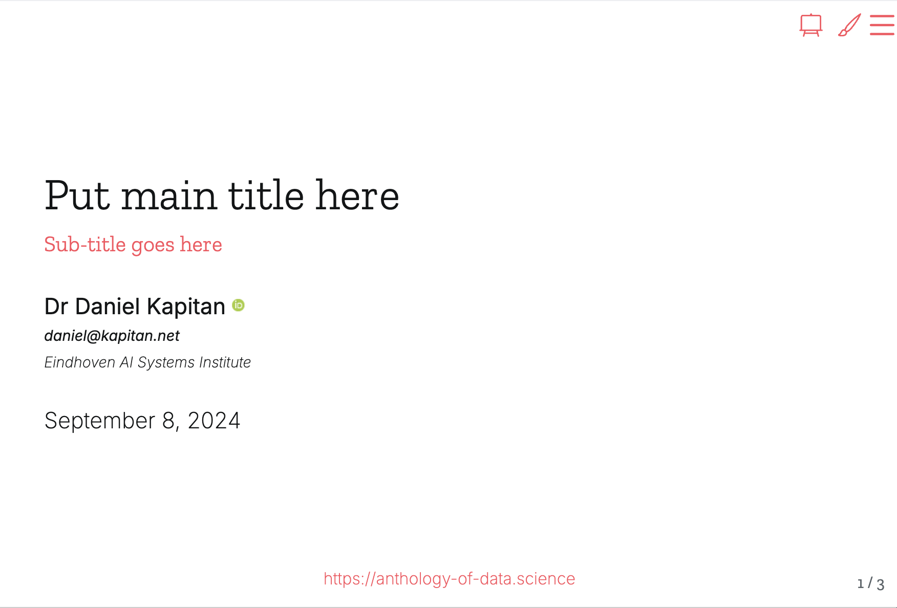

# Template for creating a Quarto reveal.js presentation

## Getting started

This template uses a [minimalist, clean theme](https://github.com/anthology-of-data-science/quarto-revealjs-clean). To use it:

- Create new repository from this template
- Clone the repository to your local machine
- Write your presentation in `index.qmd`
- Run `quarto publish gh-pages index.qmd` to publish it on GitHub

## Authoring with Quarto

- Use `#`, `##` and `###` to create sections, slides and subtitles, respectively ([docs](https://quarto.org/docs/presentations/revealjs/#creating-slides))
- Use `Div`s to change the layout as you write
  - Change font size: `::: {style="font-size: 80%;"}` 
  - Columns:   `:::: {.columns style="font-size: 80%;"}`   `::: {.column width="50%"}`

